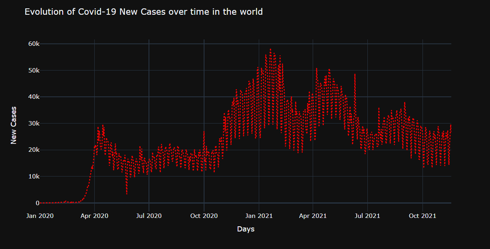

# Portfolio

---

## Data Analysis 

---
### [COVID Analysis with Python](https://github.com/kexantus/COVID-19)

---
### [Foreign Aid in Tableau](https://github.com/kexantus/Foreign-Aid)

---

## Machine Learning

---
### [Cat Sound Classifier Using Python](https://github.com/Fairfield-University-Hybrid-AI-Lab/felidetect)

---
### [Breast Cancer Prediction](https://github.com/kexantus/Breast_Cancer_Prediction)

---
