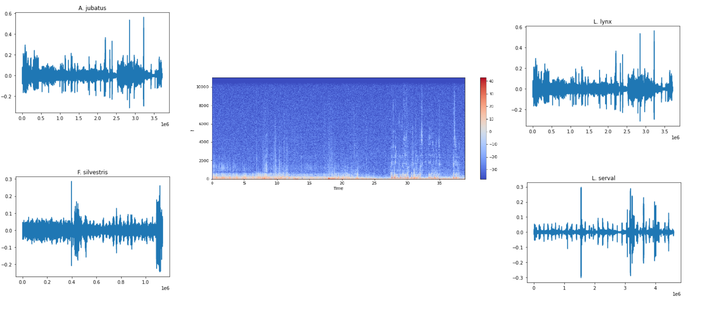

# Portfolio

---

### Machine Learning

---
[Cat Sound Classifier Using Python](https://github.com/Fairfield-University-Hybrid-AI-Lab/felidetect)

---
#[Breast Cancer Detection with Scikit Learn](https://github.com/Fairfield-University-Hybrid-AI-Lab/felidetect)
#

---

### Data Analysis 

---
[WWE Analysis with Python](https://github.com/kexantus/WWE)

---
[2021 CT Gas Price Analysis](/sample_page)

---
